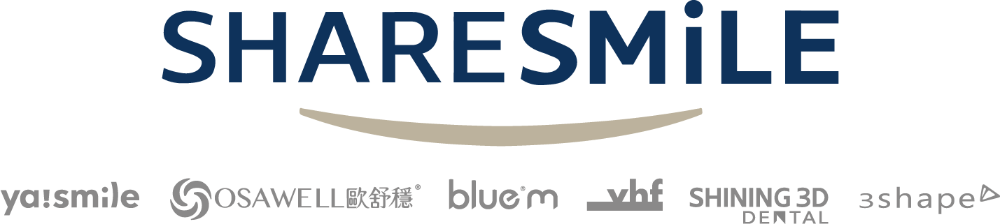

<!--
  ====================================================================
  貝殼生技 ShareSmile Biotech — GitHub Organization Profile
  File: .github/profile/README.md
  ====================================================================
  使用前必做：
  1. 在 .github repo 建立 profile/assets/ 目錄
  2. 放入 logo-light.svg / logo-dark.svg（深淺背景各一版）
     - light = 給白底用（深色 logo）
     - dark  = 給黑底用（淺色 logo）
  3. 若不做雙模式，刪掉 <picture> 只留一張  即可
  外部服務依賴：readme-typing-svg.demolab.com（動畫橫幅，可離線替換成靜態圖）
  ====================================================================
-->

<div align="center">

<!-- ───────── LOGO（Light / Dark 自動切換）───────── -->


<br/><br/>

<!-- ───────── 動態標語橫幅 ───────── -->
<a href="https://www.share-smile.co">
  
</a>

<br/>

### 貝殼生技股份有限公司 · ShareSmile Biotech

**從終身隱形矯正到睡眠呼吸的一站式醫療數位系統建構者**

<br/>

[](https://www.share-smile.co)
[](https://maps.app.goo.gl/JKNYgGYZoVaf8K9z6)
[](https://www.share-smile.co/contact/getInTouch)

</div>

<br/>

---

## ◆ Who We Are

貝殼生技是一家以**數位技術為核心**的牙科醫療科技公司，專注於把高度個人化、非標準化的牙科治療，轉化為**精準、可預期、具規模效益**的數位治療解決方案。

我們整合 **digital scanning → AI computation → treatment design → manufacturing output** 的完整鏈路，涵蓋全口重建、隱形矯正與牙科睡眠醫療（Dental Sleep / OAT），把原本高度依賴經驗的臨床流程，重構為可預測、可複製的系統化工程。

> **經營策略｜全球資源 · 本地智造 · 數位驅動**
> 從科技代理到智慧醫療品牌的縱向整合。

<br/>

## ◆ The Digital Pipeline

```text
  ┌──────────────┐   ┌──────────────┐   ┌──────────────┐   ┌──────────────┐
  │   INPUT      │   │   COMPUTE    │   │   DESIGN     │   │   OUTPUT     │
  │  數位臨床輸入 │──▶│  AI 運算引擎  │──▶│  治療設計     │──▶│  數位智造     │
  ├──────────────┤   ├──────────────┤   ├──────────────┤   ├──────────────┤
  │ 口掃 / 臉掃   │   │ 咬合 / 氣道   │   │ 矯正 / OAT   │   │ 3D 列印       │
  │ 桌掃 (3D)    │   │ 下顎動態模擬  │   │ 全口重建      │   │ 5D 齒雕       │
  └──────────────┘   └──────────────┘   └──────────────┘   └──────────────┘
       SHINING3D          AI Engine          ya!smile           SHINING3D
                                             OSAWELL              vhf
```

<br/>

## ◆ Our Brands

<table>
<tr>
<td width="50%" valign="top">

### 🦷 Ya!Smile
**Lifelong Alignment ｜ 終身美學與咬合健康管理**

旗艦品牌。將「牙齒矯正」從週期療程，提升為結合正確診斷、科技製程與持續追蹤的**終身咬合健康承諾**。

[](https://www.ya-smile.com/)

</td>
<td width="50%" valign="top">

### 😴 OSAWELL
**Dental Sleep Medicine ｜ 牙科睡眠醫學**

切入阻塞型睡眠呼吸中止症（OSA）。首創結合 3D 影像與 AI 引擎，將傳統 MAD 下顎前移治療提升至 **3D 空間考量**。

[](https://www.osawell.com/)

</td>
</tr>
</table>

<br/>

## ◆ Engineering Principles

我們在 **enterprise-grade（IPO 等級）** 標準下建構系統。公開組織下的每一行 code 都遵循：

| 原則 | 說明 |
|------|------|
| **Zero-Trust Security** | 預設不信任，最小權限，全鏈路驗證 |
| **QMS-Aligned** | 醫療器材軟體開發對齊品質管理體系規範 |
| **High Availability** | 系統穩定性與可用性優先於開發速度 |
| **Reproducible by Design** | 臨床流程數位化 = 可預測、可複製、可追蹤 |
| **PR-Driven Collaboration** | 受保護的 `main` / `develop`，CI 全綠 + Review 才可 merge |

<br/>

## ◆ Tech Stack


<div align="center">


</div>

<br/>

---

<div align="center">

**貝殼生技股份有限公司 ShareSmile Biotech**

📍 新北市中和區建一路 186 號 7 樓　｜　📞 02-8221-3088　｜　✉️ service@share-smile.co

<sub>© ShareSmile Biotech. All Rights Reserved.</sub>

</div>
